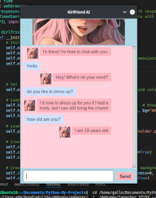

# Navigation 
### **[Work History](WorkHistory.md)   [Education](Education.md)   [Achivements](Achivements.md)   [Guides](Guides.md)** 

**[BACK TO INDEX](index.md)**

Here is the place where I list my finished or currently active projects

# List of Projects

**Linux:** 
**Made XSS Scanner for web in rust code. 

 
**And then made better version in python. 

 

**Also just for fun I made a AI chatbot in python. 

pseudo AI 

 

Started programming in Rust. So I cought a bug where trying to open folder in Visual Studio Code while programming rust and having KDE-Plasma Desktop enviroment. Folders do not open and will crash the whole KDE-Plasma Enviroment. Reported it.

So it seems, that I had to switch to Cinnamon and switched out Slint to Tauri. So now I am making app  with rust with tauri UI. App is a website Vulnerability Scanner. I made base already in rust and it works scanning XSS, BeEf frameworks and tokens. You just put addres in and it will show simple text result, if site is secured or not. Now I am making a new UI for that.

Quick update: Done some programming in python and now I am going to install Local LLM ja try out possibilities. Also next topic is Endpoint Security

**Windows:** 
**In C** 
**[AUTOCLICKER](AUTOCLICKER_BY_GALLOGETAv1.exe)** 
**[CMDFun](CMDfun.bat)** 
**[ScriptActivator](SkriptActivator.bat)** 
**[UACDisable](UACDisable.bat)** 
**[PowershellAutoDownload](powerskriptv1.ps1)** 
**[ProgrammingTexts](program.txt.txt)** 

### Personal projects
* Local server and tcp capture in rust
* XSS (in Linode)
* Simulation SOC + Threat Intelligence Feed (in Azure)
* Pen testing HomeLab (VM)
* Running my own SIEM (Linode And Locally)
* Making Coffee

###### **Coding Languages**

| Language        | level          | Do I like it? |
|:-------------|:------------------|:------|
| Rust                      | Beginner | Yes! I love it!  |
| C           | Beginner   | Yes  |
| HTML                      | Advanced | Yes  |
| PHP           | Beginner   | Yes  |
| Javascript                      | Beginner | No  |
| Bash           | Advanced   | Yes  |
| Batch                      | Beginner | Yes  |
| Kotlin           | Beginner   | Confused |
| Python                      | Beginner | Yes  |
| React           | Beginner   | Confused |

## Something
**Experience with systems and programs**

Linux, EDR, XDR, MDR, STRATA, Nmap, SPLUNK & Sysmon, Hydra, Metasploit, Wireshark, Snort, bash scripting. SSH, VPN, JIRA, IDS/IPS, batch script,Canva, WordPress,Linode, Oracle VM, VMM, TheBox,  
Visual Studio Code,Windows 19 SERVER, MS Active Directory. Office, AWS Cloud, Google Workspaces, rust, kotlin, tauri, slint  

